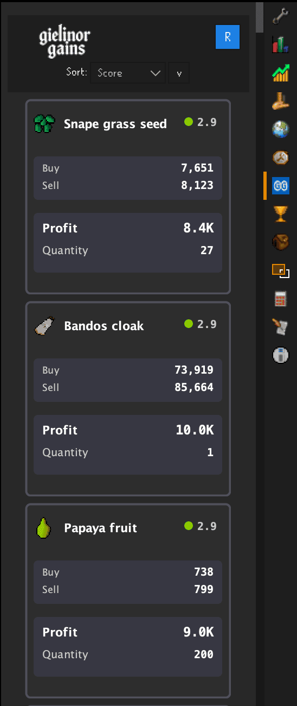
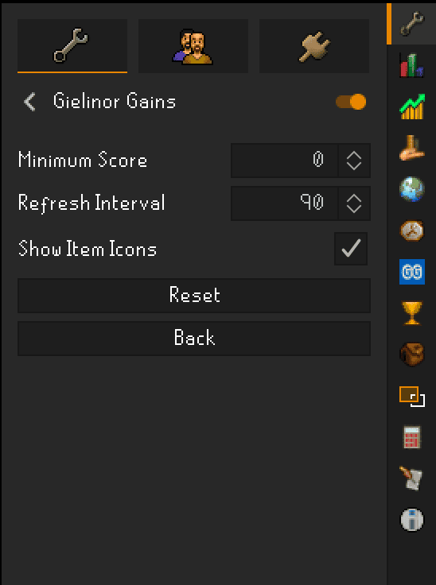

# Gielinor Gains RuneLite Plugin

A RuneLite plugin that brings [GielinorGains.com](https://gielinorgains.com) trading opportunities directly into your OSRS client. View profitable Grand Exchange trades without switching between the game and your browser.

## How it Works

The Gielinor Gains plugin analyzes OSRS Wiki market data to identify profitable trading opportunities using a sophisticated scoring algorithm that focuses on contrarian signals and oversold conditions. Unlike other trading platforms, it's completely free with no paywalls, using a "positive profit factor" approach where wins significantly outweigh losses over time.

The plugin displays trading opportunities in a card grid format, ranking them by score (higher = better opportunity) through intelligent analysis:

**Data Collection**
- Fetches latest prices and volumes from OSRS Wiki API
- Analyzes 5-minute timeseries data covering ~30 hours of trading history
- Updates every 90 seconds with smart caching for optimal performance

**Scoring Algorithm (0-5 Scale)**
- **Technical Indicators**: RSI and ROC analysis to identify oversold conditions and momentum reversals
- **Volume Analysis**: Advanced trader activity scoring evaluates market depth, buy/sell balance, and execution feasibility while filtering whale manipulation
- **Risk-Adjusted Returns**: Calculates volatility-adjusted ROI using standard deviation, ATR, and Bollinger Bands for capital efficiency
- **Contrarian Signals**: Identifies oversold bounce opportunities through RSI < 30, negative ROC momentum, and EMA trend reversals

**Score Interpretation**
- Scores typically range from 2.4-3.0 (higher = better opportunity)
- Small score differences represent significant trading advantages
- Algorithm focuses on asymmetric opportunities where wins outweigh losses

**Dynamic Pricing**
- Automatically calculates optimal buy/sell prices based on real-time conditions
- Adapts spreads based on market liquidity and volatility
- Accounts for Grand Exchange tax in all profit calculations

## Screenshots

### Main Plugin Interface

### Plugin Settings

## Installation

1. Open RuneLite and go to the Plugin Hub
2. Search for "Gielinor Gains"
3. Install and enable the plugin
4. Find the Gielinor Gains icon in your sidebar

## Features

- **Latest Market Data**: On-demand access to current trading opportunities from GielinorGains.com
- **Smart Scoring**: Multi-factor algorithm ranking opportunities from 0-5
- **Dynamic Pricing**: Automated buy/sell price calculations with market-adaptive spreads
- **Volume Analysis**: Trading quantity recommendations based on actual market activity
- **Item Icons**: Visual item identification with automatic loading and caching
- **Filtering**: Configurable minimum score threshold
- **OSRS Wiki Integration**: Click items to view detailed wiki information

## Support

Found a bug or have a feature request? Please [submit an issue](https://github.com/cameronspears/gielinor-gains-runelite/issues) on GitHub.

For questions about trading strategies or the scoring algorithm, visit [GielinorGains.com](https://gielinorgains.com).